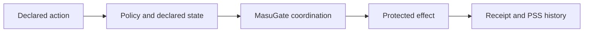

# MasuGate

**The problem:** agent actions can execute against stale authorization or
outdated policy state; MasuGate turns a declared action into a governed,
protected execution with an inspectable decision-and-effect record.

**Explore:** [Visit the project website](https://masugate.github.io/) ·
[Run in five minutes](#five-minute-local-demonstration) ·
[Read the arXiv paper](https://arxiv.org/abs/2608.02764) ·
[Trace the paper-to-code provenance](docs/paper-and-provenance.md) ·
[Inspect the evidence](docs/claims-and-limitations.md#reading-evidence-responsibly) ·
[Report an issue](https://github.com/masugate/masugate/issues) ·
[Read the security policy](SECURITY.md)

Get the current public source from the
[GitHub repository](https://github.com/masugate/masugate), or
[download the `main` branch as a ZIP archive](https://github.com/masugate/masugate/archive/refs/heads/main.zip).
The branch archive is a source snapshot, not a tagged package release.

## Three concrete contributions

1. **A declared-action runtime.** MasuGate executes declared actions under a
   protected policy rather than treating a policy response as a reusable
   authorization token. Its HTTP boundary is deliberately **execute, never
   check**: a committed response means the governed effect has already
   happened.
2. **Policy-state serializability (PSS).** The runtime retains the policy state
   and terminal history needed to check whether a governed execution is
   serializable over declared policy state.
3. **Receipts with runnable evidence.** The reference profile retains a receipt
   of the decision and effect, and the shipped demonstration, tests, and claim
   documentation make the supported research boundary inspectable.

## Execution flow



## Flagship result

The five-minute `procurement` demonstration preserves the contrast between a
deliberately unsafe stale execution and a governed execution over declared
policy state.

| Unsafe stale execution | Governed execution |
|---|---|
| The evidence retains a stale concurrent baseline for inspection. | The governed execution is PSS-valid and retains a successful receipt of its decision and effect. |

> **Research-preview boundary:** this `0.1.1` release is not a
> general compliance product, a distributed transaction system, or an assurance
> claim for arbitrary hosts, policies, models, or external services.

## Start here

| If you are… | Read… |
|---|---|
| New to the project | [Concepts](docs/concepts.md) and [Architecture](docs/architecture.md) |
| Assessing the research boundary | [Claims and limitations](docs/claims-and-limitations.md) |
| Relating the implementation to the paper | [Paper and provenance](docs/paper-and-provenance.md) |
| Reviewing the artifact | [Artifact evaluation](docs/artifact-evaluation.md), [Release engineering](docs/release-engineering.md), [Reproduction](docs/reproduction.md), and [Expected results](docs/expected-results.md) |
| Extending the implementation | [Code map](docs/code-map.md), [Governed action walkthrough](docs/governed-action-walkthrough.md), and [Extending MasuGate](docs/extending-masugate.md) |
| Working at the wire boundary | [Protocol guide](docs/protocol.md) and the [normative protocol files](protocol/README.md) |
| Writing a connector | [Connector guide](docs/connectors.md) and the [connector SDK](connectors/sdk/README.md) |
| Using a supported agent framework | [Framework adapters](docs/framework-adapters.md) |

## Five-minute local demonstration

The smallest governed-action demonstration runs the local `procurement` scenario
from a verified release built from this exact clean source checkout. First run the
single [reviewer setup command](docs/artifact-evaluation.md#exact-one-time-setup).
That one-time step uses anonymous network access to retrieve only lock- or
digest-bound public inputs and writes `/tmp/masugate-reviewer-setup/reviewer.env`.
The demonstration itself needs no credential or network access.

The setup file assigns these six inputs exactly as follows:

| Variable | Exact value |
|---|---|
| `MASUGATE_RELEASE_VERIFICATION_RELEASE_DIR` | `/tmp/masugate-reviewer-setup/release` |
| `MASUGATE_OFFLINE_NPM_CACHE` | `/tmp/masugate-reviewer-setup/demo-npm-cache` |
| `MASUGATE_SOURCE_REVISION` | `1373f5507c1680c60a7700d8a6c26a8b4d3fb025` |
| `MASUGATE_SOURCE_DATE_EPOCH` | `1785365155` |
| `MASUGATE_CANDIDATE_DIR` | `/tmp/masugate-reviewer-setup/candidate` |
| `MASUGATE_REVIEWER_PYTHON` | `/tmp/masugate-reviewer-setup/venv/bin/python` |

From any shell, with the setup directory present and the demo output absent,
run this exact block:

```sh
. /tmp/masugate-reviewer-setup/reviewer.env
cd "$MASUGATE_CANDIDATE_DIR"
test ! -e /tmp/masugate-five-minute-demo
"$MASUGATE_REVIEWER_PYTHON" scripts/run_reference_demos.py procurement \
  --release-dir "$MASUGATE_RELEASE_VERIFICATION_RELEASE_DIR" \
  --offline-npm-cache "$MASUGATE_OFFLINE_NPM_CACHE" \
  --source-revision "$MASUGATE_SOURCE_REVISION" \
  --source-date-epoch "$MASUGATE_SOURCE_DATE_EPOCH" \
  --outdir /tmp/masugate-five-minute-demo
```

Success prints `MasuGate procurement evidence:` followed by
`/tmp/masugate-five-minute-demo/evidence/procurement.json` and exits with
status zero. That evidence retains a deliberately unsafe stale concurrent
baseline, the governed PSS-valid execution, its successful governed receipt,
and both PSS results. The runner also writes `evidence/run-metadata.json`; the
supplied verifier checks these four observations and the complete command's
sub-five-minute duration. The scenario starts a disposable local Compose stack,
creates project-scoped containers, internal networks, volumes, and first-party
images, then removes them automatically. It retains only the JSON evidence and
staged output below the named `/tmp` directory.

```sh
"$MASUGATE_REVIEWER_PYTHON" scripts/verify-flagship-demo.py \
  --outdir /tmp/masugate-five-minute-demo
```

After inspecting the evidence, remove only that disposable output:

```sh
rm -r -- /tmp/masugate-five-minute-demo
```

See [Reproduction](docs/reproduction.md) and
[Expected results](docs/expected-results.md) for the prerequisite boundary,
nondeterministic fields, measured gate time, and failure interpretation. Do not
use `--keep-stack` for this quickstart.

## Descriptor integrity check

The smallest local integrity check validates the checked-in release descriptor
and its referenced identities. Run it from the repository root in the approved
Python environment:

```sh
. /tmp/masugate-reviewer-setup/reviewer.env
cd "$MASUGATE_CANDIDATE_DIR"
"$MASUGATE_REVIEWER_PYTHON" scripts/build-reference-release.py --verify-only
```

It exits successfully without building a release bundle when the descriptor,
package identities, locks, schemas, and catalog inputs agree. It is an
integrity check, not a demonstration and not a substitute for the full
reproduction tier. See [Reproduction](docs/reproduction.md) for the required
local tier, optional live-service validation, cleanup, and the current support
boundary.

## What is in this tree

- `src/masugate/` contains policy compilation, coordination, protected
  execution, provider/resource abstractions, PSS checking, and `masugated`.
- `protocol/` contains closed JSON Schemas and examples for the wire contract.
- `clients/`, `adapters/`, `gateway/`, and `integrations/` contain the typed
  client and host-facing surfaces.
- `operations/` and `connectors/` contain separately packaged operation packs
  and connector profiles.
- `release/` contains the machine-readable research-preview descriptor.

The [documentation map](docs/README.md) links each reader path to concrete
implementation entry points and its support boundary.

## Supported integration boundary

The release supplies replacement-only Python bindings for LangChain/LangGraph
`1.3.14`/`1.2.9`, Microsoft Agent Framework `1.12.0`, and CrewAI `1.15.6`.
It also supplies typed Python and TypeScript clients, a stdio MCP gateway, and
an OpenClaw `2026.7.1` integration. These are exact tested artifact profiles,
not a compatibility promise for other host or framework versions. See
[Framework adapters](docs/framework-adapters.md) for the installation boundary,
trusted-context requirements, and executable package examples.

## Support boundary

The checked-in reference descriptor targets Linux/amd64 with CPython 3.12 and
the named package and host-version pins. Calendar and Stripe connectors are
reference profiles: their credentialed live checks are optional and must report
`SKIPPED` when credentials or network access are unavailable. No command in
this repository should require a credential for the required local tier.

Version: `0.1.1` (research preview). Next: [Artifact evaluation](docs/artifact-evaluation.md).
