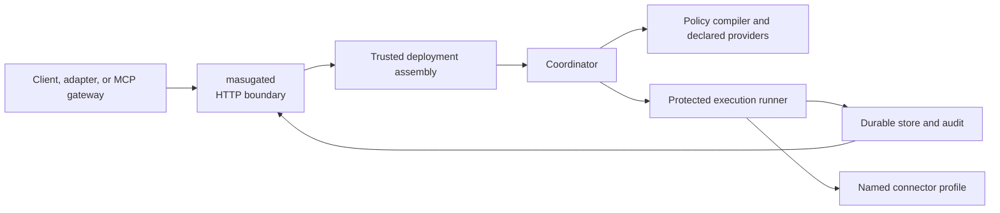

# Architecture

**Audience:** researchers, reviewers, and developers. Prerequisite:
[Concepts](concepts.md). **Supported boundary:** the checked-in reference
descriptor and named component interfaces, not an arbitrary infrastructure
deployment.

## Component responsibilities

`masugated` parses trusted deployment inputs and HTTP requests; its CLI is
[`src/masugate/masugated/cli.py`](../src/masugate/masugated/cli.py) and its
application boundary is [`app.py`](../src/masugate/masugated/app.py).
`Coordinator` owns protected admission and terminal decision flow in
[`src/masugate/coordinator.py`](../src/masugate/coordinator.py). Policy
parsing and compilation are in
[`src/masugate/language/`](../src/masugate/language/) and
[`src/masugate/policy.py`](../src/masugate/policy.py).

Providers expose declared policy-relevant state; connectors receive only the
public SDK invocation surface. The connector SDK contract is documented in
[`connectors/sdk/README.md`](../connectors/sdk/README.md). The reference
descriptor binds package and profile identities in
[`release/reference-release.json`](../release/reference-release.json).

## Trust boundaries and failure modes

- A request body cannot assert a principal, server time, or operation id; the
  server supplies those values. The protocol details the boundary in
  [`protocol/README.md`](../protocol/README.md).
- A connector is trusted code for the secret handles and destinations assigned
  to its profile. The SDK does not make arbitrary connector code safe.
- A pending result is durable state, not a permission for the caller to act.
  Resolution must return through the coordinator.
- A receipt records retained evidence; it is not an independently witnessed
  attestation.

Version: `0.1.1` (research preview). Next: [Protocol](protocol.md).
