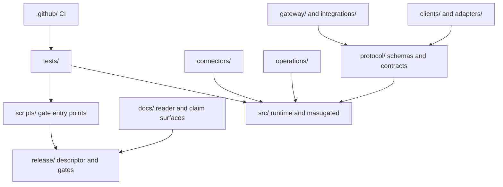

# Code map

**Audience:** developers and artifact reviewers. Read [Concepts](concepts.md)
first. **Supported boundary:** paths shipped in this release only.

Every current top-level directory is listed below. “Generated/test location”
identifies where derived output belongs or where the component is exercised;
it does not turn optional live-service checks into required local gates.

| Top-level path | Role and public entry points | Generated output and test locations |
|---|---|---|
| `.github/` | Public source-control, dormant compatibility, and release-design workflows | The source-control workflow runs read-only checks on `main` and pull requests; dormant compatibility and registry-publishing designs remain disabled; no generated workflow output belongs in this tree |
| `adapters/` | Framework-neutral Python and TypeScript adapter cores plus bounded LangChain/LangGraph, Microsoft Agent Framework, and CrewAI bindings | Package-local conformance tests; wheels and `dist/` output are disposable |
| `clients/` | Python `masugate_client` and TypeScript `@masugate/client` APIs | `clients/python/tests/`, `clients/typescript/test/`; wheels, tarballs, and `dist/` are generated outside source |
| `connectors/` | Connector SDK plus filesystem, Calendar, and Stripe reference profiles; each package exposes its `src/` API and `pyproject.toml` | Package-local tests and root integration tests; live Calendar/Stripe checks are optional and credential-gated |
| `docs/` | Reader documentation and authoritative `claims/reference-release-claims.json` | The documentation gate resolves links, validates examples, and executes classified reader commands from a clean candidate |
| `gateway/` | One-upstream stdio MCP gateway: `src/server.ts`, `src/router.ts`, manifest parser | `gateway/test/`; `dist/` and pack-smoke archives are disposable build output |
| `integrations/` | Pinned OpenClaw adapter, exact host contract, and reference stack | Package-local tests plus root spend, containment, demo, and release-gate modules; packed npm output is generated outside source |
| `operations/` | Calendar, filesystem, and spend operation packs, each rooted at `operation-pack.json` | Package-local tests; built Python distributions are release output, not source |
| `protocol/` | Normative wire guide, closed JSON Schemas, examples, and adapter contracts | `tests/test_protocol_schemas.py` and `tests/test_protocol_contract.py`; copied release schemas are generated below the chosen release output |
| `release/` | Checked-in reference descriptor, compatibility matrix, immutable action lock, release-control policy, locks, catalog inputs, and release-evidence schemas | `tests/test_release_identity.py`, `tests/test_release_controls.py`, `tests/test_npm_clean_consumer.py`, `tests/test_reference_container_artifact.py`, and `tests/test_release_verification_reference_release.py`; assembled release archives and attestations go below `--outdir` |
| `scripts/` | Descriptor and release-control verification, reviewer setup, demonstrations, containment checks, container-archive assembly, and release-gate entry points | Script behavior is covered by the corresponding root test modules; demo/release evidence is written only below explicit disposable output paths |
| `src/` | Core `masugate` runtime: policy, coordinator, PSS, providers, protected execution, resources, and `masugated` | Root unit/integration modules under `tests/`; Python bytecode and package builds must not remain in source |
| `tests/` | Sixteen root Python modules covering models, PSS, protocol, runtime, PostgreSQL, host integration, containment, crash recovery, demos, clean-consumer and container-archive controls, release identity, and optional-profile preflight | Pytest temporary state is disposable; marker-specific required services are listed in [Testing](testing.md) |

All 16 unique evidence paths named by the ten claims exist in this candidate.
A missing claim-evidence path is a release-gate failure.

## Generated-output boundary

The tree contains reviewed source inputs such as schemas, examples, lockfiles,
and the reference descriptor. It does not
retain generated Python bytecode, TypeScript `dist/` trees, package archives,
assembled release bundles, container state, or demo evidence. Reader commands
write those products below an explicit disposable `--outdir` (normally under
`/tmp`) and the gate verifies cleanup. Finding generated output in a source
directory, a missing table path, or a broken primary entry point is a
documentation/release defect.

Version: `0.1.0` (research preview). Next: [Governed action walkthrough](governed-action-walkthrough.md).
