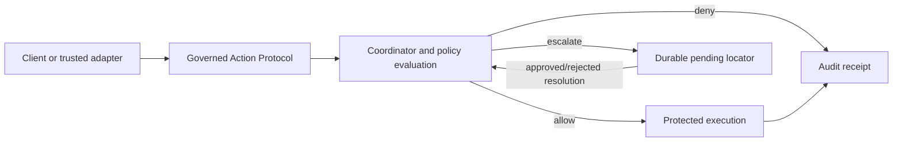
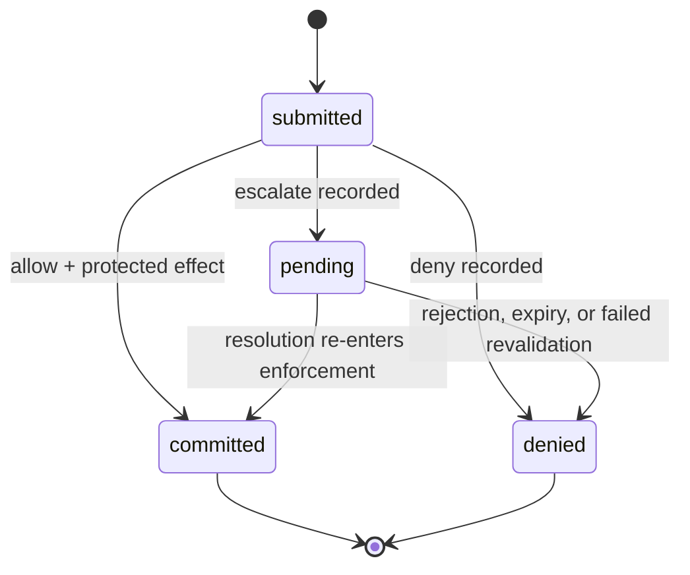

# Concepts

**Audience:** first-time readers. Start with the [README](../README.md).
**Supported boundary:** the declared-action model implemented in
[`src/masugate/`](../src/masugate/), not arbitrary agent behavior or host
deployment.

## Governed action

A caller submits an action, arguments, and stable idempotency input. The server
derives the principal and trusted context, protects the declared coordination
set, evaluates policy, and records a terminal result. The protocol’s closed
wire shapes are [here](../protocol/README.md).

## Declared policy state and PSS

Policy-state serializability (PSS) is the project’s history-checking model for
the declared policy-relevant state. A policy’s complete declared state must be
represented by conforming providers within the coordination domain. The checker
constructs WR, WW, RW, and real-time dependencies, then replays its serial
witness from recorded versions; a provider decision validator is required to
replay an arbitrary policy predicate. The implementation is in
[`src/masugate/pss/checker.py`](../src/masugate/pss/checker.py), its data model
is in [`src/masugate/pss/model.py`](../src/masugate/pss/model.py), and the
v0.1.1 semantic correction is recorded in
[PSS correction record](pss-v0.1.1-correction.md).

PSS is not a general availability, fairness, liveness, compliance, or host
integrity guarantee. It says nothing about policy-relevant state that was never
declared, outside effects that bypass the named protected boundary, or an
arbitrary deployment topology.

## Execute, never check

The action endpoint executes a governed operation; it does not issue an allow
token for a caller to apply later. A `committed` response couples an allow with
an already-applied effect. A `denied` response has no effect. A `pending`
response has no effect yet and exposes a durable locator. See the concrete
schemas for [actions](../protocol/schemas/action-request.schema.json),
[responses](../protocol/schemas/action-response.schema.json), and
[pending state](../protocol/schemas/pending-list.schema.json).

## Pending resolution and recovery

An escalation is not an allow. Resolution re-enters the protected path; the
result may commit or deny according to the configured plan and current protected
state. The coordinator and durable execution logic are implemented in
[`src/masugate/coordinator.py`](../src/masugate/coordinator.py) and
[`src/masugate/protected_execution/`](../src/masugate/protected_execution/).

## Receipts and trusted boundaries

Receipts carry the decision and execution records retained by the system. They
are not independently witnessed signatures or a claim that every surrounding
system is tamper-proof. The protocol schema is
[`protocol/schemas/audit.schema.json`](../protocol/schemas/audit.schema.json),
and the audit model is in
[`src/masugate/protected_execution/audit.py`](../src/masugate/protected_execution/audit.py).

Version: `0.1.1` (research preview). Next: [Architecture](architecture.md).
