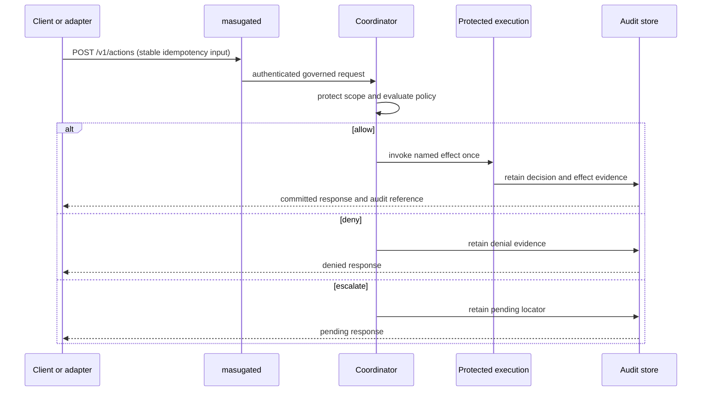

# Governed action walkthrough

**Audience:** developers and reviewers. Prerequisite: [Architecture](architecture.md).
**Example boundary:** a declared action submitted through the current HTTP
protocol; no live connector, credential, or deployment is assumed.

1. A typed client creates a request. The Python client’s public method is in
   [`clients/python/src/masugate_client/client.py`](../clients/python/src/masugate_client/client.py),
   and the wire shape is
   [`protocol/schemas/action-request.schema.json`](../protocol/schemas/action-request.schema.json).
2. `masugated` authenticates the caller and builds the trusted application;
   see [`src/masugate/masugated/app.py`](../src/masugate/masugated/app.py).
3. The coordinator protects the declared policy-state scope, evaluates policy,
   and records allow, deny, or escalation. The implementation entry point is
   [`src/masugate/coordinator.py`](../src/masugate/coordinator.py).
4. On allow, protected execution invokes the configured connector or
   transactional effect and stores the resulting audit record. See
   [`src/masugate/protected_execution/runner.py`](../src/masugate/protected_execution/runner.py)
   and [`audit.py`](../src/masugate/protected_execution/audit.py).
5. The response is validated against
   [`protocol/schemas/action-response.schema.json`](../protocol/schemas/action-response.schema.json).
   A committed payload is returned directly; callers must not execute a
   second native or upstream effect.

For a pending result, an authorized resolver submits the closed
[`resolve-request`](../protocol/schemas/resolve-request.schema.json) shape. The
result re-enters enforcement; it can still deny if the protected basis does not
support commitment. A missing credential or live service must yield the
documented `SKIPPED` outcome for optional checks, not a fabricated success.

Version: `0.1.0` (research preview). Next: [Extending MasuGate](extending-masugate.md).
